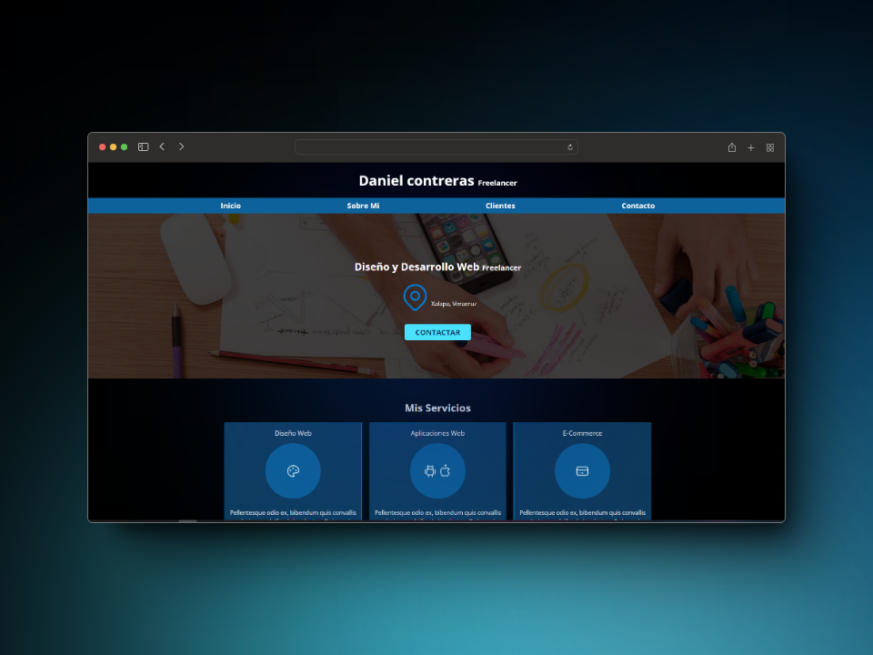

# Mi Primer Proyecto de Desarrollo Web

¡Hola a todos! Este es mi primer proyecto de desarrollo web, y estoy emocionado de compartirlo con ustedes. Aprendí las bases y habilidades esenciales gracias al curso de "Desarrollo web completo" de Juan Pablo De la Torre Valdez en Udemy. Este curso me proporcionó los conocimientos necesarios para dar vida a mi primera página web.

## Cómo Este Proyecto Me Ayuda a Seguir Aprendiendo

Este proyecto representa un avance significativo en mi viaje de aprendizaje. Al crear mi primera página web, he ganado confianza en mis habilidades y estoy emocionado por el potencial que tengo para seguir mejorando. Algunas de las habilidades que he desarrollado incluyen:

- Estructuración de HTML
- Estilizar con CSS
- Buenas practicas

## ¿Cómo Ver Mi Proyecto?

Puedes ver mi proyecto en acción visitando la siguiente URL: [https://freelancersitedany.netlify.app/]

¡Espero que disfruten explorando mi primera página web tanto como yo disfruté creándola! Agradezco cualquier retroalimentación y sugerencias para seguir mejorando.

¡Gracias a Juan Pablo De la Torre Valdez por brindarme las habilidades necesarias para llegar hasta aquí!
